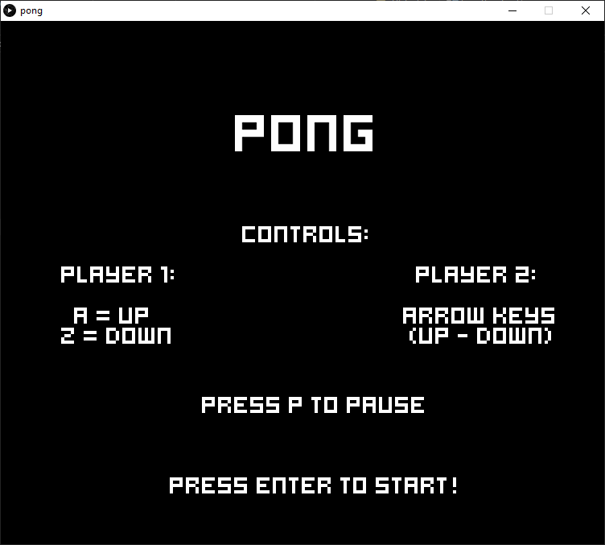
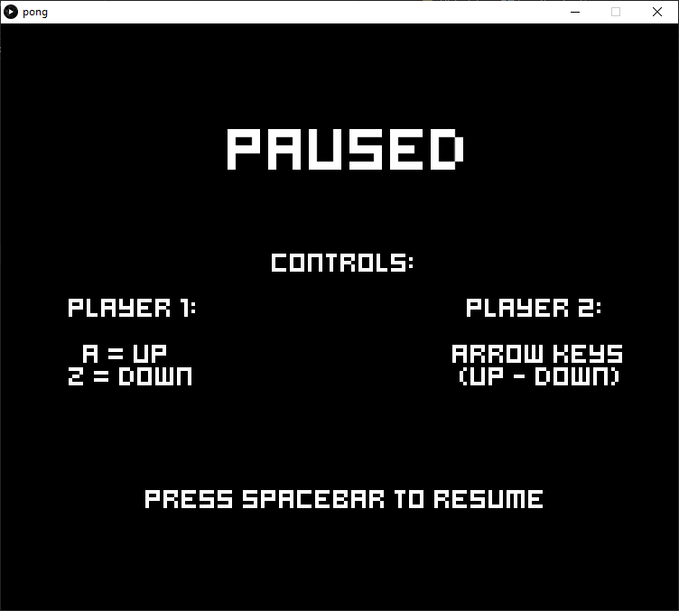
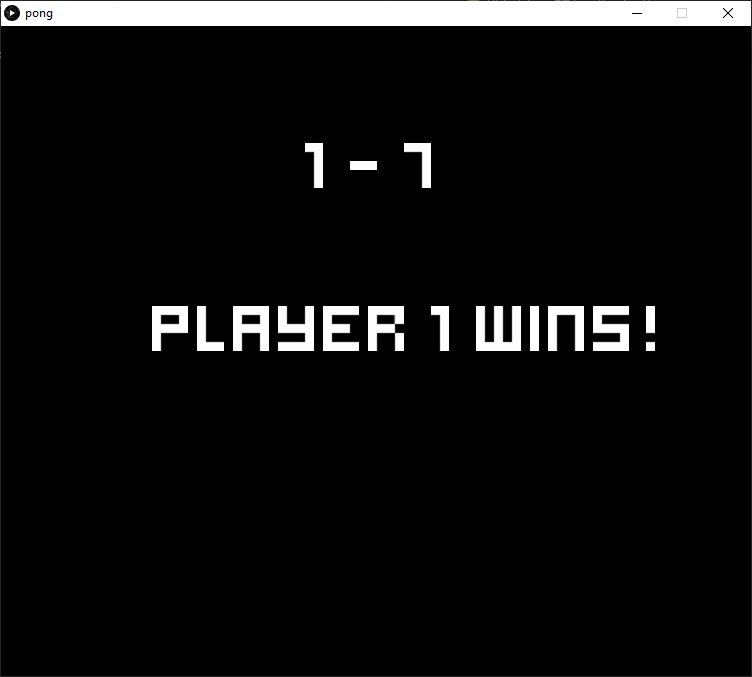
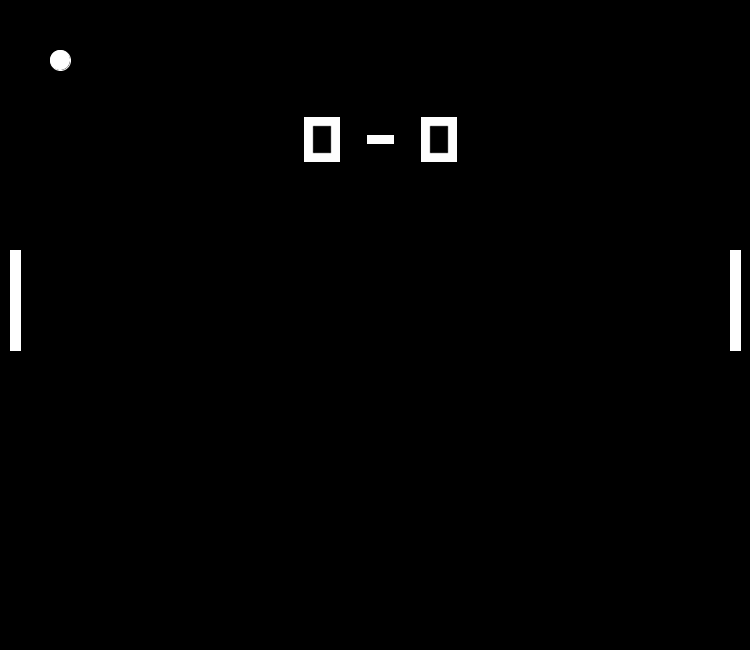

# Practica 1 - PONG

**Hecho por Borja Zarco Cerezo**

## Índice
* [Introducción](#introducción)
* [Desarrollo](#desarrollo)
    * [Jugabilidad](#jugabilidad)
    * [Sonido](#sonido)
    * [Pantallas Adicionales](#pantallas-adicionales)
* [Resultado](#resultado)
* [Referencias](#referencias)

## Introducción

Práctica realizada para la asignatura de Creando Interfaces de Usuario. Elaboración de un juego similar al Pong para dos jugadores usando [Processing](https://processing.org/) como herramienta de desarrollo. 

## Desarrollo

El trabajo resultado de la práctica ha sido un juego muy similar al pong. Para el diseño se ha tomado como referencia el clásico del juego original y se han eliminado elementos que se consideraban molestos como la barra separadora de los "campos". Se ha preferido un diseño claro y minimalista sin muchos detalles: las palas son bloques blancos lisos, así como la pelota.

También se ha tomado una tipografía que se asemejara lo máximo posible a aquellas comunes en esos juegos de época, intentando que fuera lo mas retro posible.

### Jugabilidad

Se ha apostado por el uso de las teclas 'a' y 'z' y las flechas de arriba y abajo como controles para cada jugador por la buena disposición que tienen para un juego de dos personas. Cada par de teclas está situado en un extremo del teclado, permitiendo a dos jugadores interactuar de forma cómoda con el juego. 

### Sonido

No se ha podido obtener el sonido original del pong de forma gratuita así que se ha optado por el uso de un efecto de sonido en 8-bits lo suficientemente similar de una [librería de sonidos gratuita](https://www.musicradar.com/news/tech/sampleradar-214-free-8-bit-bonanza-samples-627132).

### Pantallas adicionales

A parte de las características básicas exigidas, se añadió un menú inicial y pantalla de pausa. Esto se hizo para eliminar las instrucciones de los jugadores, como los controles de la pantalla de juego. También se tomó esta decisión para dar cierta capacidad al usuario para elegir cuándo quiere empezar a jugar o pausar la partida y retomarla. 

Además, se consideró que una partida termina cuando uno de los jugadores consigue llegar a 7 goles. Por tanto, una vez se alcanza esa condición, se muestra otra pantalla informativa a los jugadores y se vuelve al inicio.

## Resultado

El resultado de una partida sería lo que se muestra a continuación.

## Referencias

* [Guion de prácticas](https://cv-aep.ulpgc.es/cv/ulpgctp20/pluginfile.php/126724/mod_resource/content/22/CIU_Pr_cticas.pdf)
* [processing.org](https://processing.org/)
* [sonidos](https://www.musicradar.com/news/tech/sampleradar-214-free-8-bit-bonanza-samples-627132)
* [GifAnimation](https://github.com/extrapixel/gif-animation)
* [Pong](https://www.ponggame.org/)
