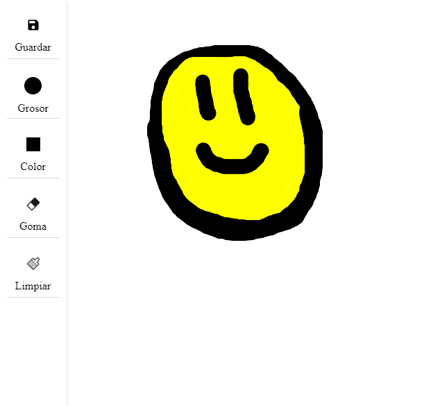

# Practica 8 - Introducción a P5JS

**Hecho por Borja Zarco Cerezo**

## Índice
- [Introducción](#introducción) 
- [Desarrollo](#desarrollo)
- [Uso](#uso)
- [Resultado](#resultado)
- [Referencias](#referencias)

## Introducción

El objetivo de esta práctica es el de familiarizarse con un nuevo entorno de desarrollo. Se trata de p5js, unaa libería de JavaScript para la creación de proyectos de forma similar a Processing. Para ello había que elaborar una aplicación como el *Paint* con las funciones mínimas. 

## Desarrollo

En este caso, se ha decidido por hacer la aplicación requerida con algunos extras. Las funcionalidades desarrolladas son las siguientes:

- Guardar el dibujo
- Cambiar el grosor del pincel y la goma.
- Cambiar el color del pincel.
- Limpiar el lienzo
- Goma de borrar

> **Nota:** No sale ni en la captura ni en el proyecto live de p5JS pero el cursor cambia su icono a un lapiz o a una goma (dependiendo de cual esté seleccionado) mientras está encima del canvas

## Resultado

Aqui dejo una demo de la aplicación resultante: 

## Referencias

* [Guion de prácticas](https://cv-aep.ulpgc.es/cv/ulpgctp20/pluginfile.php/126724/mod_resource/content/22/CIU_Pr_cticas.pdf)
* [Documentación P5JS](https://p5js.org/)
